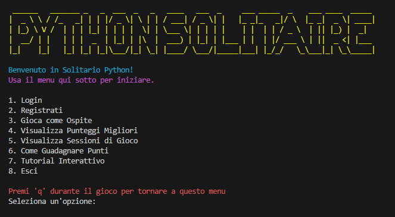
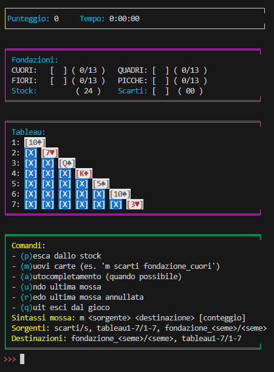
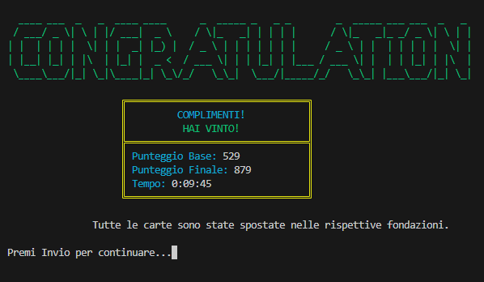

# 🃏 Solitario Python


Un gioco completo del **Solitario** da giocare nel terminale!
Include gestione utenti, database, punteggi, comandi interattivi, animazioni e una vera esperienza da gioco retro. 🖥️

---

## 📸 Anteprime

### 🖥️ Menu iniziale


### 🎮 Partita in corso


### 🏆 Schermata di vittoria


---

## 📁 Struttura del Progetto

```
solitario/
├── init.py
├── main.py                  ✅ Punto d’ingresso
├── data/                    ✅ Dove viene salvato il file "solitario.db"
├── models/                  ✅ Classi principali del gioco
│     ├── init.py
│     ├── carte.py           
│     ├── gioco.py           
│     └── utenti.py          
├── database/                ✅ Gestione database
│     ├── init.py
│     └── db.py              
└── ui/                      ✅ Interfaccia utente CLI
      ├── init.py
      └── cli.py             
```

---

## ▶️ Come Avviare il Progetto

1. **Scarica la repository**.

2. **Scarica il requirements.txt**.

3. **Installa le dipendenze**:
   ```bash
   pip install requirements.txt
   ```

4. **Avvia il gioco**:
   ```bash
   python main.py
   ```

---

## 🎮 Comandi nel Gioco

| Comando | Azione |
|---------|--------|
|   `p`   | Pesca una carta dallo stock |
|   `m`   | Muovi carte: `m sorgente destinazione [conteggio]` |
|   `a`   | Autocompleta fondazioni |
|   `u`   | Undo ultima mossa |
|   `r`   | Redo mossa annullata |
|   `q`   | Esci dal gioco |

Sorgenti/destinazioni: `scarti`/`s`, `tableau1-7`/`t1-7`/`1-7`, `fondazione_<seme>`/`f_<seme>`/`<seme` .

---

## 👤 Utenti & Punteggi

- Sistema di **login/registrazione**
- **Salvataggio automatico** delle partite
- Classifica punteggi migliori e cronologia sessioni

---

## 🧩 Moduli e Classi

### `models/carte.py`
- `Carta`, `Mazzo`, `Pila`, `PilaFondazione`, `PilaStock`

### `models/gioco.py`
- `GiocoSolitario`: logica di gioco
- `StatoGioco`: per undo/redo

### `models/utenti.py`
- `GestoreUtenti`: login, punteggi, cronologia

### `database/db.py`
- `inizializza_db()`, `NOME_DB`

### `ui/cli.py`
- `InterfacciaSolitario`: menu, comandi, rendering

---

## 🏅 Sistema di Punteggio

| Azione                          | Punti |
|---------------------------------|-------|
| Da scarti a tableau             | +10   |
| Da scarti a fondazione          | +15   |
| Da tableau a fondazione         | +5    |
| Scoprire una carta coperta      | +5    |
| Pesca dallo stock               | +2    |
| Undo                            | -15   |
| Riciclo scarti                  | -20   |
| Da fondazione a tableau         | -5    |

Bonus Tempo:

|      Tempo      |     Bonus    |
|-----------------|--------------|
| < 5 minuti      |  +350 punti  |
| < 10 minuti     |  +250 punti  |
| < 15 minuti     |  +150 punti  |
| < 20 minuti     |  +50 punti   |
| > 20 minuti     | -1 punto/30s |

---


## 🧪 Debug/Testing

- Puoi eseguire direttamente `main.py` per provare il gioco.
- Non richiede test automatici, ma il codice è modulare e facilmente testabile.

---
